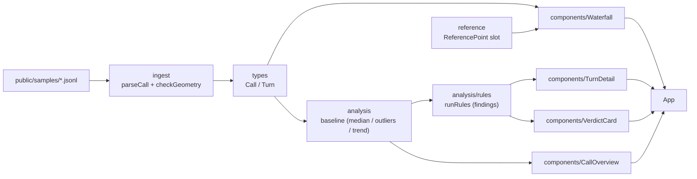
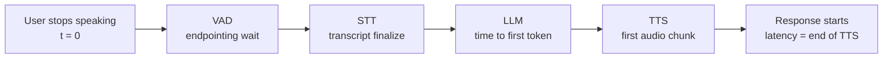

# Architecture

A pure client-side SPA: it reads JSONL call logs in the browser, validates them, and renders
a per-turn latency waterfall. There is no backend and no LLM in the analysis path.

## Module map

<!-- sync-docs:begin module-map -->

- `types/` — shared TypeScript types, derived from Zod schemas: `Call`, `Turn`, `Stage`, `StageTiming`, and the `ReferencePoint` benchmark slot.
- `ingest/` — JSONL parsing and validation (`parseCall`) plus the non-fatal stage-geometry warning pass (`checkGeometry`, `turnLatencyMs`).
- `analysis/` — within-call comparison math (`stageMedians`, `latencyMedian`, `turnComparison`, `outlierTurns`, `trendingStage`, `stageTrends`); every signal is relative to the call's own median, no absolute thresholds.
- `analysis/rules/` — the deterministic rule engine (`runRules`): pattern→advice rules over the comparison math, each emitting a ranked `Finding` (cause, fix, and the basis it measured against). Absolute thresholds live in one documented `thresholds` file, framed as rules of thumb.
- `reference/` — the v1.1 per-stage reference-number slot (`referencePoints`), empty until numbers are cited.
- `components/Waterfall/` — the single-turn SVG waterfall: pure `layout` math (`scaleLinear`, `buildTicks`, `layoutTurn`), the `Waterfall` view, and shared stage colors/labels.
- `components/CallOverview/` — the multi-turn overview: per-turn rows with stage mini-bars and median-relative ratio badges, plus a summary strip naming the rising stage and outlier turns.
- `components/VerdictCard/` — the ranked findings list (or an explicit clean bill) from the rule engine.
- `components/TurnDetail/` — the per-turn strip under the waterfall naming the selected turn's slow stage and any findings that flag it.

<!-- sync-docs:end module-map -->

## Component graph

<!-- sync-docs:begin architecture -->

<!-- sync-docs:end architecture -->

## Stage pipeline (data flow)

The waterfall measures one turn's pipeline. Time-zero is the moment the user stops speaking;
each stage's duration is measured from there, and a turn's latency is the end of TTS first-audio.

<!-- sync-docs:begin data-flow -->

<!-- sync-docs:end data-flow -->
